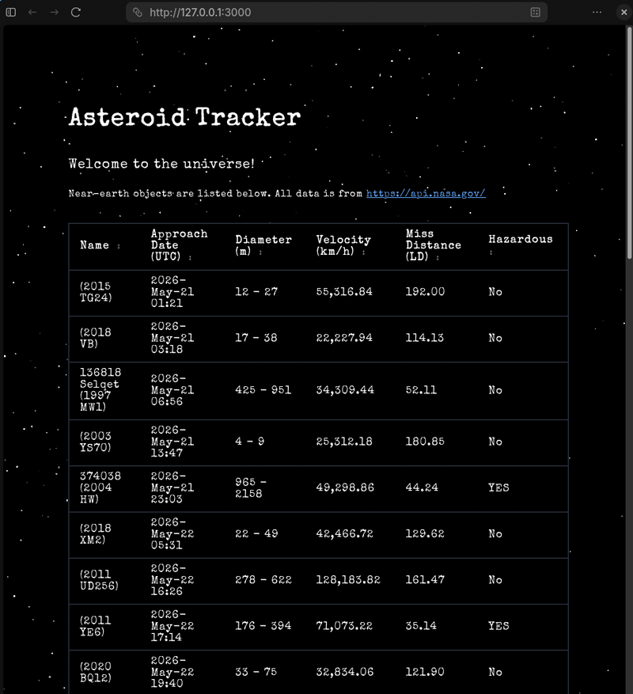

# Asteroid Tracker

A small full-stack Rust web app that displays near-earth object data from NASA. Built with [Leptos](https://leptos.dev/) (SSR + WebAssembly hydration) on top of axum, with a custom WebGL2 starfield rendered via `web-sys`.

Uses NeoWs API from:
https://api.nasa.gov/



## Running with Docker (recommended)

Requires Docker (Docker Desktop includes everything you need).

```
docker compose up --build
```

Then open http://localhost:3000/.

To use your own NASA API key, create a `.env` file in the project root:

```
NASA_API_KEY=your_key_here
```

## Running with cargo

Requirements: Rust 1.85+ (uses edition 2024), the `wasm32-unknown-unknown` target, and [`cargo-leptos`](https://github.com/leptos-rs/cargo-leptos).

```
rustup target add wasm32-unknown-unknown
cargo install cargo-leptos
cargo leptos serve
```

Then open http://127.0.0.1:3000/.

## NASA API key

`.env.local` ships with `NASA_API_KEY=DEMO_KEY` so the app runs out of the box. The demo key is limited to ~30 requests/hour per IP; for higher limits, get a free key at https://api.nasa.gov/ and replace the value.

The server caches successful responses in memory keyed by date, so it only hits the NASA API once per day per process.
